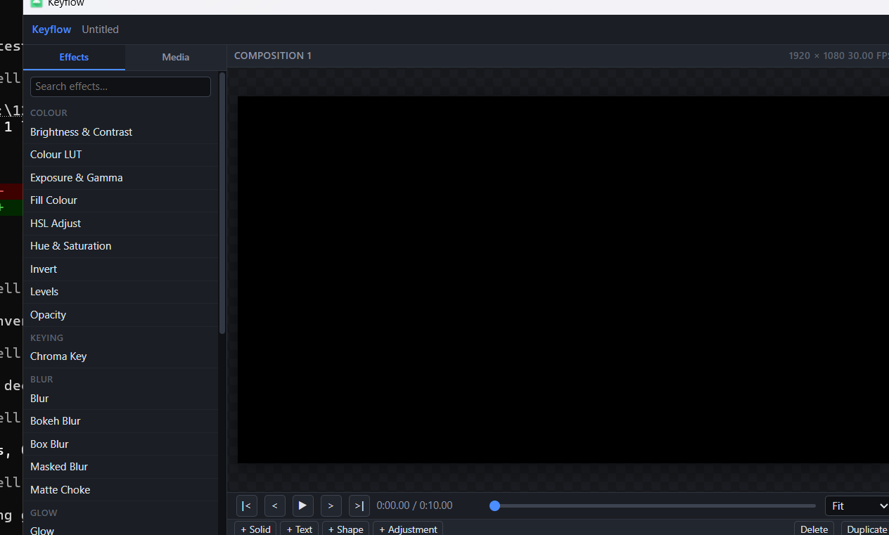

# Keyflow

A GL-shader video editor for Windows.

This is a port of the Android app **Keyflow** (`com.angkin.keyflow`), rebuilt
as a native Win32 application with an HTML interface. The APK's 63 GLSL
shaders, effect catalogue, document model and project format were recovered
from the DEX and carried across; the shell around them is new.



## What it does

An effect stack per layer, a compositor with 21 blend modes, keyframes with
four interpolation modes, an expression language, and a timeline. The effect
set is the recovered one:

- **Colour** — brightness/contrast, exposure/gamma, hue/saturation, HSL,
  levels, LUT, invert, fill
- **Keying** — chroma key with spill suppression, matte choke
- **Blur** — box, bokeh with an eight-blade iris, masked, separable
- **Glow** — bloom with tint and chromatic aberration, highlight recovery
- **Stylise** — CMYK halftone, pixelate, scanlines, fractal noise, ASCII,
  sharpen
- **Generate** — audio spectrum, gradients, shapes, light flare
- **Motion** — wiggle, ripple, swirl, transform, motion blur
- **Transition** — rectangular, linear and radial wipes
- **Distort** — chromatic aberration, grain, outline, edge detect, drop shadow

## Requirements

- Windows 10 or 11, 64-bit
- A GPU with OpenGL 2.0 (any machine from the last fifteen years)
- The [Microsoft Edge WebView2 runtime](https://developer.microsoft.com/microsoft-edge/webview2/)
  — already present on Windows 11 and on any machine with a current Edge
- [ffmpeg](https://ffmpeg.org/download.html) on `PATH`, or beside `keyflow.exe`

ffmpeg is needed to import video and to export. The editor runs without it:
you can build a composition from solids, shapes and text, and the preview
works. It is only the decode and encode that need it.

## Build

```
git clone https://github.com/thewoldaa/keyflow-win
cd keyflow-win

scripts/fetch-deps.ps1            # the WebView2 SDK, once per checkout

cmake --preset dev
cmake --build --preset dev
ctest --preset dev
```

The executable lands at `build/dev/bin/keyflow.exe`.

`fetch-deps.ps1` downloads the WebView2 SDK into `third_party/`, which is
git-ignored. Without it the core library and its tests still build — the model,
the project format and the shaders are all platform-neutral — so you can work
on those without the SDK.

## Using it

| | |
|---|---|
| **Space** | play / pause |
| **← →** | step one frame |
| **Shift + ← →** | step ten frames |
| **Home / End** | go to the start / the end |
| **Ctrl + Z / Ctrl + Y** | undo / redo |
| **Ctrl + S / Ctrl + O / Ctrl + N** | save / open / new |
| **Delete** | remove the selected layer |

Add a layer with the buttons under the timeline, then pick an effect from the
browser on the left. The inspector on the right shows the selected layer's
transform and its effect stack. A parameter's ◆ button adds a keyframe at the
playhead; with keyframes present, editing a value adds one at the current time
rather than overwriting the curve.

An expression can drive any parameter — `time * 100`, `wiggle(2, 30)`,
`clamp(frame, 0, 100)`. The evaluator is a formula language over the layer's
own context: no file access, no network, no scripting host. See
`src/core/Expression.cpp`.

## How it is put together

Three interfaces, each with one job:

- **Page to host** — JSON messages. The page sends intent; the host applies it
  and broadcasts a fresh document. The page never edits its own copy, so the
  two sides cannot drift.
- **Host to page** — the host calls `window.__keyflowReceive` with a JSON
  string.
- **Renderer to catalogue** — one table in `EffectCatalog.cpp` drives the
  effect browser, the inspector's controls, the renderer's uniform binding and
  project files. One table rather than four, because four lists drift.

`docs/ARCHITECTURE.md` has the detail, including why ffmpeg is a subprocess
rather than a linked library and why the shaders are rewritten at compile time.
`docs/SHADERS.md` covers where the shaders came from, what had to be done to
them, and what did not survive the shrinker.

## Testing

```
ctest --preset dev                     # 122 unit cases, no GPU needed
build/dev/bin/keyflow.exe --self-test  # compiles all 63 shaders, renders a frame
build/dev/bin/keyflow.exe --layout-report  # measures the interface
```

Three layers, each answering a question the others cannot. The unit tests have
no GL context, so they cannot tell you a shader compiles; the self-test has no
assertions, so it cannot tell you a keyframe interpolates correctly. The layout
report exists because "the interface looks wrong" is otherwise an afternoon of
guessing at CSS.

## Not there yet

Stated plainly rather than left to be discovered:

- **No audio.** Import detects an audio stream and the timeline shows it, but
  nothing decodes or mixes it.
- **No 3D compositor.** The camera uniforms are in the model and the particle
  vertex shader is recovered, but the renderer does not project through a
  camera.
- **No multi-pass effects.** The catalogue carries a `passes` field and the
  glow shader is written for a pyramid, but the renderer runs one pass per
  effect.
- **No GPU video decode.** ffmpeg decodes to system memory and the frame is
  uploaded.

The frame cache, audio and the multi-pass pipeline are the next three things,
in that order.

## Working on it

Parallel work uses the wave harness: one task, one branch, one worktree, one
build directory, and a declared file territory per task.

```
scripts/harness/wave-new.ps1 -Wave 1 -Task renderer   # start
scripts/harness/wave-list.ps1                         # see what is running
scripts/harness/wave-done.ps1 -Task renderer          # finish, test, merge
```

A task declares the files it owns in `tasks/wave-<n>/<task>.md`. The harness
refuses to start a task whose territory overlaps another in the same wave — a
conflict found before the worktree exists costs nothing, and the same conflict
found after a day of parallel work costs the day. `tasks/README.md` has the
format.

## Licence

MIT. See `LICENSE`.
